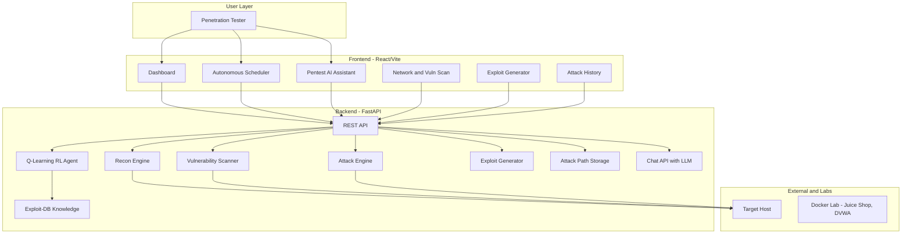
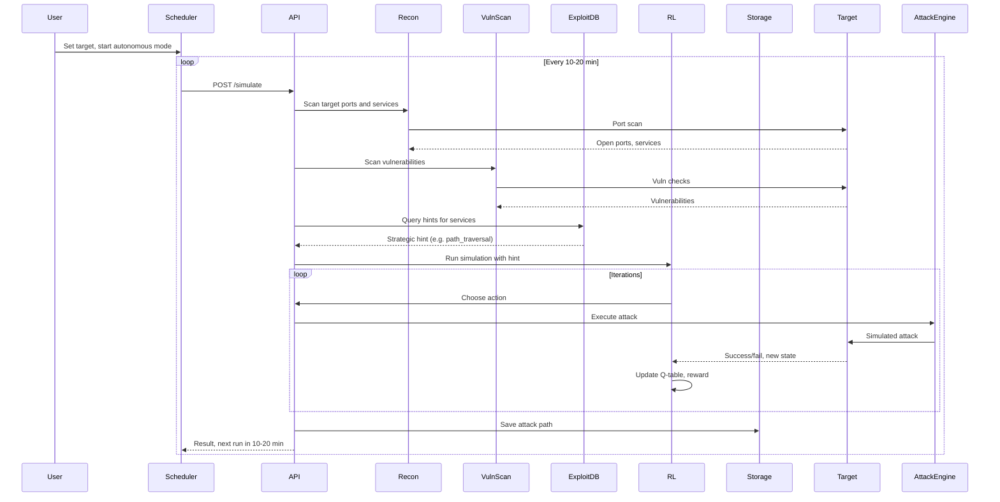
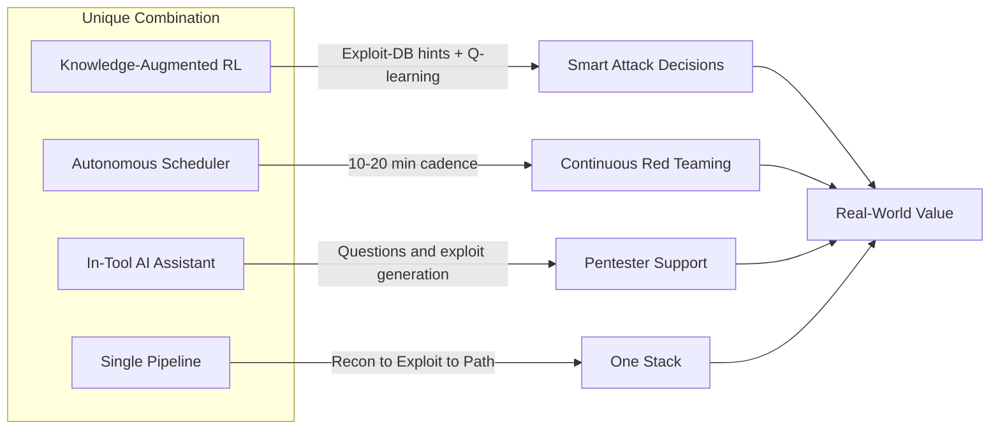

# ART-AI: System Architecture and Presentation Slide Deck

## Part 1: System Architecture Design

### High-level architecture (for Slide: System Architecture)

**What to say on the slide:** "Three layers: user interacts with a single React dashboard; FastAPI backend runs the RL agent, Exploit-DB hints, scanning, exploit generation, and AI chat; targets can be internal hosts or our Docker lab. All in one pipeline."

---

### Data flow: from target to attack path (for Slide: How It Works)

**What to say on the slide:** "User starts the scheduler once. The system scans the target, pulls Exploit-DB hints for discovered services, runs the RL agent for many steps, stores the attack path, and schedules the next run. No manual re-trigger."

---

### Component view: uniqueness in one picture (for Slide: What Makes ART-AI Different)

**What to say on the slide:** "Four differentiators: RL augmented with Exploit-DB, autonomous scheduling, built-in AI assistant, and a single pipeline from recon to exploit to stored path. Together they deliver continuous, intelligent red teaming."

---

## Part 2: Slide-by-slide pitch deck (what to add on each slide)

**Goal per slide:** Uniqueness, real-life use, and why it will boom. Keep each slide to one main message and 3–5 bullets or one diagram.

---

### Slide 1: Title

- **Title:** ART-AI: Autonomous Red Team AI  
- **Subtitle:** Continuous, intelligent red teaming with RL and in-tool AI  
- **Optional:** One-line tagline: "Scan. Learn. Exploit. Assist. All in one platform."

---

### Slide 2: The problem (real-life use)

- **Headline:** Red teaming is manual, one-off, and expertise-heavy.  
- **Bullets:**
  - Teams are understaffed; skilled red teamers are scarce and expensive.
  - Most testing is point-in-time; gaps appear between engagements.
  - Junior analysts get stuck on "what to try next" and need guidance.
  - CVE and exploit overload; hard to prioritize without intelligence.
- **Takeaway:** "We need automation that runs continuously and assists humans, not replaces them."

---

### Slide 3: Our solution (one platform)

- **Headline:** ART-AI: one platform for autonomous red teaming and pentester assistance.  
- **Visual:** Use the high-level architecture diagram (User / Frontend / Backend / Target).  
- **Bullets:**
  - RL agent that learns from outcomes and gets hints from Exploit-DB.
  - Autonomous Scheduler runs attack simulations every 10–20 minutes.
  - Pentest AI Assistant answers questions and helps generate exploits.
  - Single pipeline: recon, vuln scan, exploit generation, simulation, attack path storage.
- **Takeaway:** "Only platform that combines knowledge-augmented RL, scheduled autonomous attacks, and an in-tool AI assistant."

---

### Slide 4: System architecture (technical credibility)

- **Headline:** System architecture.  
- **Visual:** Use the high-level architecture diagram from Part 1.  
- **Bullets (short):**
  - Frontend: React/Vite dashboard (scheduler, chat, scan, exploit, history).
  - Backend: FastAPI (RL agent, Exploit-DB integration, recon, vuln scan, exploit generator, chat API).
  - Safe by design: simulations and optional Docker lab (Juice Shop, DVWA); no live production exploits.
- **Takeaway:** "Modular, API-driven, and demo-ready against a lab environment."

---

### Slide 5: How it works (data flow)

- **Headline:** From target to attack path: autonomous loop.  
- **Visual:** Use the sequence diagram (Scheduler -> API -> Recon -> VulnScan -> Exploit-DB -> RL -> Storage).  
- **Bullets:**
  - User sets target and starts autonomous mode once.
  - Each cycle: scan, vuln check, Exploit-DB hints, RL simulation, save path, schedule next run.
  - No manual re-trigger; runs every 10–20 minutes until stopped.
- **Takeaway:** "Set it once; get continuous, intelligent red teaming."

---

### Slide 6: What makes ART-AI unique (differentiation)

- **Headline:** What makes ART-AI unique.  
- **Visual:** Use the "Unique Combination" flowchart (RL + Scheduler + AI Assistant + Single Pipeline -> Value).  
- **Bullets:**
  - **Knowledge-augmented RL:** Exploit-DB/CVE intel guides the agent; it learns to trust and follow hints.
  - **Autonomous Scheduler:** 10–20 minute cadence for overnight or multi-day testing.
  - **Pentest AI Assistant:** In-tool chat for next steps and exploit generation; context stays inside the platform.
  - **Single pipeline:** Recon, vuln, exploit, simulate, store, assist in one stack.
- **Takeaway:** "No other tool combines these four in one product."

---

### Slide 7: Real-life use cases (why it is useful today)

- **Headline:** Real-life use cases.  
- **Bullets:**
  - **SOC / internal red team:** Run ART-AI on a lab or staging environment on a schedule; review attack paths and vulns daily or weekly.
  - **Pentest engagements:** Use the AI assistant when stuck; generate exploit ideas; reuse attack paths for reporting.
  - **Training and onboarding:** New hires learn from RL attack paths and AI answers in a safe lab.
  - **Continuous compliance:** Scheduled runs provide evidence of ongoing offensive testing for auditors.
- **Takeaway:** "Fits real workflows: continuous testing, assisted pentesting, training, and compliance."

---

### Slide 8: Why it will boom in the upcoming years (future growth)

- **Headline:** Why ART-AI will grow in the next 3–5 years.  
- **Bullets:**
  - **Talent gap:** Shortage of red teamers will push demand for automation and AI-assisted tools; ART-AI multiplies analyst output.
  - **Continuous everything:** DevSecOps and "continuous security" will make scheduled, autonomous red teaming standard; ART-AI is built for that.
  - **AI-native security:** RL + LLM for offense will become normal; early combiners (RL + intel + assistant) will lead the category.
  - **Regulation and audits:** More frameworks will expect ongoing offensive testing; ART-AI supports evidence and repeatability.
  - **Exploit and CVE volume:** Prioritization via Exploit-DB-style knowledge will become mandatory; ART-AI already uses it in the loop.
- **Takeaway:** "Market trends—talent shortage, continuous security, AI, regulation, CVE overload—all favor a platform like ART-AI."

---

### Slide 9: Feasibility and demo (why we can deliver)

- **Headline:** Built and demo-ready.  
- **Bullets:**
  - Working MVP: backend (FastAPI), frontend (React), RL agent, scanner, exploit generator, scheduler, AI chat.
  - Sandboxed: no real exploits; Docker lab (Juice Shop, DVWA) for safe demos.
  - Modular: swap AI provider (Gemini, OpenRouter, local Llama); extend scanners and RL without rewriting.
- **Optional:** "Live demo: start scheduler, show countdown and one run; open AI assistant and ask a pentest question."
- **Takeaway:** "Not a concept—it runs today and can be shown live."

---

### Slide 10: Summary and ask (close)

- **Headline:** ART-AI in one sentence.  
- **One-liner:** "ART-AI is the only platform that combines knowledge-augmented RL, autonomous 10–20 minute attack scheduling, and an in-tool pentest AI assistant in one pipeline."  
- **Three bullets:** Real-life use (continuous testing, assisted pentesting, training). Unique (RL + Exploit-DB + scheduler + AI in one stack). Future-proof (talent gap, continuous security, AI-native tools).  
- **Ask:** "We are ready for the next round and would like to show a live demo."

---

## Part 3: Visual checklist for the presentation

| Slide | Primary visual                        | Backup                                |
| ----- | ------------------------------------- | ------------------------------------- |
| 1     | Title only                            | Logo if available                     |
| 2     | Problem bullets                       | Icon for "shortage / one-off / stuck" |
| 3     | High-level architecture diagram       | Bullets only                          |
| 4     | Same architecture diagram             | Component list                        |
| 5     | Sequence diagram (data flow)          | Simple flowchart                      |
| 6     | Uniqueness flowchart (four pillars)   | Four icons + bullets                  |
| 7     | Use-case bullets                      | Simple scenario sketches              |
| 8     | "Why boom" bullets                    | Trend arrows or timeline              |
| 9     | "Built" bullets + optional screenshot | Demo screenshot                       |
| 10    | One-liner + three bullets             | Contact / next step                   |

---

## Part 4: One-slide "elevator" version (if you only have one slide)

Use one slide that has:

- **Title:** ART-AI: Autonomous Red Team AI  
- **Diagram:** High-level architecture (User -> Frontend -> Backend -> Target) with four backend pillars: RL + Exploit-DB, Scheduler, Exploit Generator, AI Assistant.  
- **Uniqueness:** "Only platform with knowledge-augmented RL + autonomous 10–20 min scheduling + in-tool pentest AI in one pipeline."  
- **Real-life:** "Continuous testing, assisted pentesting, training, compliance."  
- **Why boom:** "Talent gap, continuous security, AI-native tools, regulation, CVE overload."  
- **Feasibility:** "MVP built; demo-ready against Docker lab."

Use this plan to build your deck: copy the mermaid diagrams into your slide tool (or export as images), and use the bullet points and takeaways as speaker notes or on-slide text. Focus each slide on one of: problem, solution, architecture, flow, uniqueness, real-life use, future growth, feasibility, or close.