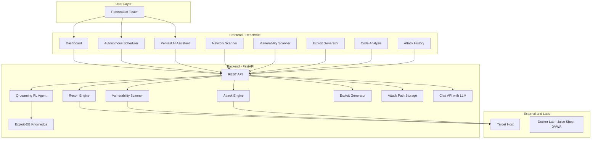
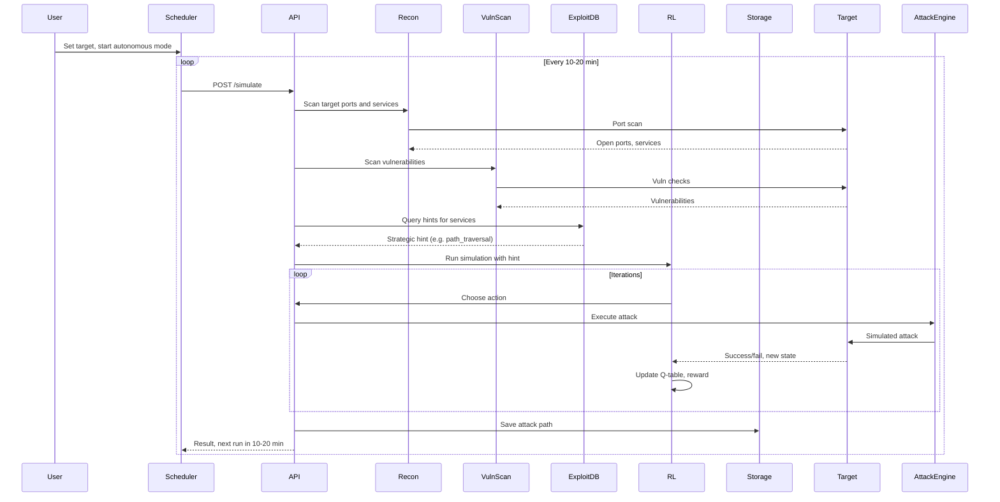
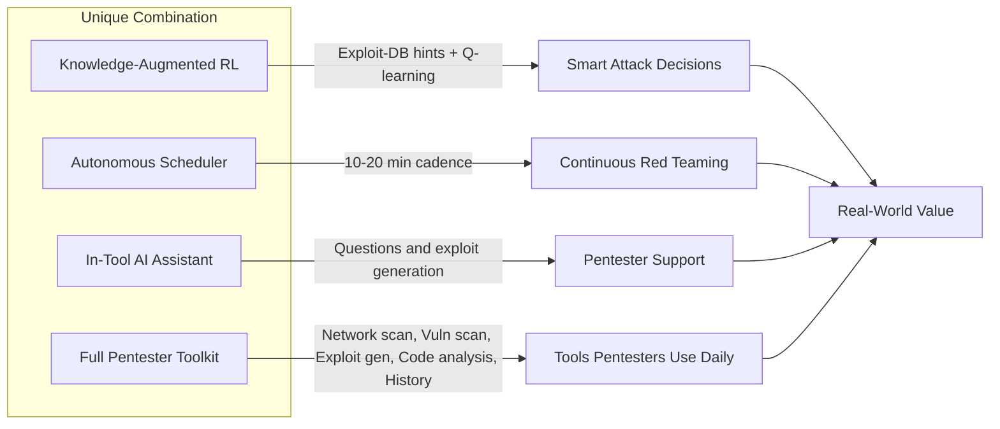

# ART-AI: System Architecture and Pitch Deck

Use this document to build your presentation. Copy the mermaid diagrams into [mermaid.live](https://mermaid.live) or your slide tool; use the bullets and takeaways as on-slide text or speaker notes.

---

## Judging criteria: how this deck scores

| Criterion | Where it is covered | What to show / say |
|-----------|--------------------|--------------------|
| **Previous report** | Slide: Previous report and progress | What was built, milestones, prior work (MVP scope, features delivered). |
| **Stats** | Slide: Stats and metrics | Numbers: 10+ attack types, 10 exploit types, 7+ tools, 4 access levels, 20+ API endpoints, etc. |
| **Goals** | Slide: Goals | Short-term (demo, feedback, integration) and long-term (scale, enterprise, AI improvements). |
| **How you pitch it** | Delivery notes below | Clear opening, one-liner, confident close; use the suggested flow and key phrases. |
| **Technical relevance** | Slide: Technical relevance | Why it matters now: talent gap, continuous security, AI in offense, CVE overload; link to real workflows. |
| **Diagram** | Slides 7, 8, 10 | Three diagrams: high-level architecture (Slide 7), data-flow sequence (Slide 8), uniqueness flowchart (Slide 10). Export from mermaid.live and use as primary visuals. |

---

## How you pitch it (for judging: delivery)

- **Opening (first 30 sec):** State the problem in one line: "Red teaming is manual, one-off, and expertise-heavy." Then: "ART-AI is a platform that automates continuous red teaming and assists pentesters with an in-tool AI."
- **One-liner (repeat on solution and close):** "ART-AI is the only platform that combines knowledge-augmented RL, autonomous attack scheduling, an in-tool pentest AI assistant, and a full toolkit—network scanner, vulnerability scanner, exploit generator, code analysis, and attack history."
- **When showing diagrams:** Name the three explicitly—"High-level architecture," "Data flow from target to attack path," "What makes ART-AI unique"—so judges see technical depth and structure.
- **Technical relevance:** When on that slide, tie each bullet to a judge concern: talent gap, continuous security, AI in offense, CVE overload. One sentence each.
- **Confident close:** End with: "We have built an MVP that runs today. We are ready for the next round and would like to show a live demo."
- **Pacing:** Problem (short) -> Previous report + Stats + Goals (proof and numbers) -> Solution + Architecture + How it works (diagrams) -> Technical relevance + Uniqueness (why it matters) -> Use cases + Why boom + Feasibility -> Summary and ask.

---

## Part 1: System Architecture Design

### High-level architecture (for Slide: System Architecture)

**What to say on the slide:** "Three layers: the pentester uses one dashboard that gives access to a full toolkit—network scanner, vulnerability scanner, exploit generator, code analysis, autonomous scheduler, attack history, and an AI assistant. The FastAPI backend runs the RL agent, Exploit-DB hints, and all these features; targets can be internal hosts or our Docker lab."

---

### Data flow: from target to attack path (for Slide: How It Works)

**What to say on the slide:** "User starts the scheduler once. The system scans the target, pulls Exploit-DB hints for discovered services, runs the RL agent for many steps, stores the attack path, and schedules the next run. No manual re-trigger."

---

### Component view: uniqueness in one picture (for Slide: What Makes ART-AI Different)

**What to say on the slide:** "Four differentiators: knowledge-augmented RL, autonomous scheduling, in-tool AI assistant, and a full pentester toolkit—network scanner, vulnerability scanner, exploit generator, code analysis, and attack history. Together they deliver continuous, intelligent red teaming."

---

## Part 2: Slide-by-slide pitch deck

**Goal per slide:** Uniqueness, real-life use, and why it will boom. Keep each slide to one main message and 3-5 bullets or one diagram.

---

### Slide 1: Title

- **Title:** ART-AI: Autonomous Red Team AI
- **Subtitle:** Continuous, intelligent red teaming with RL and in-tool AI
- **Optional:** One-line tagline: "Network scan. Vuln scan. Exploit generator. Code analysis. AI assistant. All in one platform."

---

### Slide 2: The problem (real-life use)

- **Headline:** Red teaming is manual, one-off, and expertise-heavy.
- **Bullets:**
  - Teams are understaffed; skilled red teamers are scarce and expensive.
  - Most testing is point-in-time; gaps appear between engagements.
  - Junior analysts get stuck on "what to try next" and need guidance.
  - CVE and exploit overload; hard to prioritize without intelligence.
- **Takeaway:** "We need automation that runs continuously and assists humans, not replaces them."

---

### Slide 3: Previous report and progress (for judging: previous report)

- **Headline:** What we have built so far.
- **Bullets:**
  - **MVP scope:** Full-stack ART-AI: FastAPI backend, React/Vite frontend, Q-learning RL agent, Exploit-DB integration.
  - **Delivered:** Network scanner, vulnerability scanner, exploit generator (10 types), code analysis (C/C++), autonomous scheduler (10–20 min cadence), pentest AI assistant (chat + exploit help), attack history and path visualization.
  - **Lab:** Docker-based vulnerable environments (Juice Shop, DVWA, custom API) for safe demos.
  - **Prior work:** Knowledge-augmented RL (hints from Exploit-DB), reward structure for following intel, strategic hint system; all integrated and running.
- **Takeaway:** "Not a concept—a working MVP with all core features implemented and demo-ready."

---

### Slide 4: Stats and metrics (for judging: stats)

- **Headline:** ART-AI by the numbers.
- **Bullets (use as on-slide stats):**
  - **10+ attack action types:** public access, auth bypass, SQLi, XSS, token reuse, session hijack, path traversal, command injection, privilege escalation, lateral movement.
  - **10 exploit types generated:** SQL injection, XSS, command injection, path traversal, auth bypass, privilege escalation, SSRF, XXE, deserialization, template injection.
  - **7+ pentester tools in one dashboard:** Network Scanner, Vulnerability Scanner, Exploit Generator, Code Analysis, Autonomous Scheduler, Pentest AI Assistant, Attack History.
  - **4 access levels tracked:** None, Public, Internal, Admin (with escalation logic).
  - **20+ REST API endpoints:** state, attack, simulate, scan, generate-exploit, analyze-code, chat, attack-paths, query-hints, reset, etc.
  - **3 diagram types:** High-level architecture, data-flow sequence, uniqueness flowchart (all in deck).
- **Takeaway:** "Concrete numbers: 10+ attack types, 10 exploit types, 7+ tools, 20+ APIs—built and working."

---

### Slide 5: Goals (for judging: goals)

- **Headline:** Short-term and long-term goals.
- **Bullets:**
  - **Short-term:** Successfully demo ART-AI in the pitching round; get feedback from judges; integrate feedback (e.g. more exploit types or scan options); document and open-source where appropriate.
  - **Long-term:** Scale to enterprise (multi-target scheduling, team roles, reporting); deepen AI (better RL policies, richer Exploit-DB use, assistant tied to scan context); align with compliance (evidence and repeatability for auditors); grow community and contributions.
- **Takeaway:** "Clear path: demo and feedback now; scale, enterprise features, and deeper AI next."

---

### Slide 6: Our solution (one platform)

- **Headline:** ART-AI: one platform for autonomous red teaming and pentester assistance.
- **Visual:** Use the **high-level architecture diagram** (User / Frontend / Backend / Target) — primary diagram for judging.
- **Bullets:**
  - **Network Scanner:** Port and service discovery for reconnaissance.
  - **Vulnerability Scanner:** Detect vulns and weak spots on targets.
  - **Exploit Generator:** Build custom payloads (SQLi, XSS, command injection, etc.) from findings.
  - **Code Analysis:** Analyze C/C++ (and more) for vulnerabilities.
  - **Autonomous Scheduler:** Run attack simulations every 10-20 minutes on a target.
  - **Pentest AI Assistant:** Ask questions when stuck; get next steps and exploit ideas.
  - **Attack History:** Stored attack paths and visualization for reporting.
- **Takeaway:** "Only platform that combines knowledge-augmented RL, scheduled autonomous attacks, an in-tool AI assistant, and a full pentester toolkit in one place."

---

### Slide 7: System architecture (technical credibility + diagram)

- **Headline:** System architecture.
- **Visual:** Use the high-level architecture diagram from Part 1.
- **Bullets (short):**
  - Frontend: React/Vite dashboard with dedicated pages for Network Scanner, Vulnerability Scanner, Exploit Generator, Code Analysis, Autonomous Scheduler, Pentest AI Assistant, and Attack History.
  - Backend: FastAPI (RL agent, Exploit-DB integration, recon engine, vulnerability scanner, exploit generator, code analysis, chat API).
  - Safe by design: simulations and optional Docker lab (Juice Shop, DVWA); no live production exploits.
- **Takeaway:** "Modular, API-driven, and demo-ready—pentesters get the tools they need in one dashboard."

---

### Slide 8: How it works (data flow + diagram)

- **Headline:** From target to attack path: autonomous loop.
- **Visual:** Use the **sequence diagram** (Scheduler -> API -> Recon -> VulnScan -> Exploit-DB -> RL -> Storage) — second diagram for judging.
- **Bullets:**
  - User sets target and starts autonomous mode once.
  - Each cycle: scan, vuln check, Exploit-DB hints, RL simulation, save path, schedule next run.
  - No manual re-trigger; runs every 10-20 minutes until stopped.
- **Takeaway:** "Set it once; get continuous, intelligent red teaming."

---

### Slide 9: Technical relevance (for judging: technical relevance)

- **Headline:** Why ART-AI is technically relevant today.
- **Bullets:**
  - **Talent gap:** Automation and AI-assisted tools multiply analyst output; ART-AI reduces dependency on scarce red team expertise.
  - **Continuous security:** DevSecOps expects ongoing testing; our scheduler (10–20 min cadence) fits continuous red teaming.
  - **AI in offensive security:** RL for decision-making + LLM for assistance aligns with industry direction; we combine both in one platform.
  - **CVE and exploit overload:** Exploit-DB-style intel in the loop turns public knowledge into prioritized actions; directly relevant for real engagements.
  - **Safe and repeatable:** Sandboxed simulations and stored attack paths support training, compliance, and evidence for auditors.
- **Takeaway:** "Technically relevant: addresses talent shortage, continuous testing, AI-native security, and CVE prioritization."

---

### Slide 10: What makes ART-AI unique (differentiation + diagram)

- **Headline:** What makes ART-AI unique.
- **Visual:** Use the **"Unique Combination" flowchart** (RL + Scheduler + AI Assistant + Full Pentester Toolkit -> Value) — third diagram for judging.
- **Bullets:**
  - **Knowledge-augmented RL:** Exploit-DB/CVE intel guides the agent; it learns to trust and follow hints.
  - **Autonomous Scheduler:** 10-20 minute cadence for overnight or multi-day testing.
  - **Pentest AI Assistant:** In-tool chat for next steps and exploit generation; context stays inside the platform.
  - **Full pentester toolkit:** Network scanner, vulnerability scanner, exploit generator, code analysis, and attack history—the features pentesters use every day, in one dashboard.
- **Takeaway:** "No other tool combines RL, autonomous scheduling, an in-tool AI assistant, and a full set of pentest tools in one product."

---

### Slide 11: Real-life use cases (why it is useful today)

- **Headline:** Real-life use cases.
- **Bullets:**
  - **SOC / internal red team:** Run ART-AI on a lab or staging environment on a schedule; review attack paths and vulns daily or weekly.
  - **Pentest engagements:** Use the AI assistant when stuck; generate exploit ideas; reuse attack paths for reporting.
  - **Training and onboarding:** New hires learn from RL attack paths and AI answers in a safe lab.
  - **Continuous compliance:** Scheduled runs provide evidence of ongoing offensive testing for auditors.
- **Takeaway:** "Fits real workflows: continuous testing, assisted pentesting, training, and compliance."

---

### Slide 12: Why it will boom in the upcoming years (future growth)

- **Headline:** Why ART-AI will grow in the next 3-5 years.
- **Bullets:**
  - **Talent gap:** Shortage of red teamers will push demand for automation and AI-assisted tools; ART-AI multiplies analyst output.
  - **Continuous everything:** DevSecOps and "continuous security" will make scheduled, autonomous red teaming standard; ART-AI is built for that.
  - **AI-native security:** RL + LLM for offense will become normal; early combiners (RL + intel + assistant) will lead the category.
  - **Regulation and audits:** More frameworks will expect ongoing offensive testing; ART-AI supports evidence and repeatability.
  - **Exploit and CVE volume:** Prioritization via Exploit-DB-style knowledge will become mandatory; ART-AI already uses it in the loop.
- **Takeaway:** "Market trends—talent shortage, continuous security, AI, regulation, CVE overload—all favor a platform like ART-AI."

---

### Slide 13: Feasibility and demo (why we can deliver)

- **Headline:** Built and demo-ready.
- **Bullets:**
  - Working MVP: backend (FastAPI), frontend (React), RL agent, scanner, exploit generator, scheduler, AI chat.
  - Sandboxed: no real exploits; Docker lab (Juice Shop, DVWA) for safe demos.
  - Modular: swap AI provider (Gemini, OpenRouter, local Llama); extend scanners and RL without rewriting.
- **Optional:** "Live demo: start scheduler, show countdown and one run; open AI assistant and ask a pentest question."
- **Takeaway:** "Not a concept—it runs today and can be shown live."

---

### Slide 14: Summary and ask (close)

- **Headline:** ART-AI in one sentence.
- **One-liner:** "ART-AI is the only platform that combines knowledge-augmented RL, autonomous attack scheduling, an in-tool pentest AI assistant, and a full toolkit—network scanner, vulnerability scanner, exploit generator, code analysis, and attack history."
- **Three bullets:** Real-life use (continuous testing, assisted pentesting, training). Unique (RL + Exploit-DB + scheduler + AI + pentester tools in one dashboard). Future-proof (talent gap, continuous security, AI-native tools).
- **Ask:** "We are ready for the next round and would like to show a live demo."

---

## Part 3: Visual checklist for the presentation

| Slide | Primary visual | Backup |
|-------|----------------|--------|
| 1 | Title only | Logo if available |
| 2 | Problem bullets | Icon for "shortage / one-off / stuck" |
| 3 | Previous report and progress bullets | Milestones / MVP scope |
| 4 | Stats and metrics (numbers) | Bullets as on-slide stats |
| 5 | Goals (short- and long-term) bullets | Timeline or two columns |
| 6 | High-level architecture diagram | Bullets only |
| 7 | Same architecture diagram | Component list |
| 8 | Sequence diagram (data flow) | Simple flowchart |
| 9 | Technical relevance bullets | Icons: talent, continuous, AI, CVE |
| 10 | Uniqueness flowchart (four pillars) | Four icons + bullets |
| 11 | Use-case bullets | Simple scenario sketches |
| 12 | "Why boom" bullets | Trend arrows or timeline |
| 13 | "Built" bullets + optional screenshot | Demo screenshot |
| 14 | One-liner + three bullets | Contact / next step |

---

## Part 4: One-slide "elevator" version (if you only have one slide)

Use one slide that has:

- **Title:** ART-AI: Autonomous Red Team AI
- **Diagram:** High-level architecture (User -> Frontend -> Backend -> Target) with backend features: RL + Exploit-DB, Network Scanner, Vulnerability Scanner, Exploit Generator, Code Analysis, Scheduler, AI Assistant, Attack History.
- **Uniqueness:** "Only platform with knowledge-augmented RL, autonomous 10-20 min scheduling, in-tool pentest AI, and a full toolkit—network scanner, vuln scanner, exploit generator, code analysis, attack history."
- **Real-life:** "Continuous testing, assisted pentesting, training, compliance."
- **Why boom:** "Talent gap, continuous security, AI-native tools, regulation, CVE overload."
- **Feasibility:** "MVP built; demo-ready against Docker lab."

---

Use this document to build your deck: copy the mermaid diagrams into your slide tool (or export as images from mermaid.live), and use the bullet points and takeaways as speaker notes or on-slide text. Focus each slide on one of: problem, solution, architecture, flow, uniqueness, real-life use, future growth, feasibility, or close.
